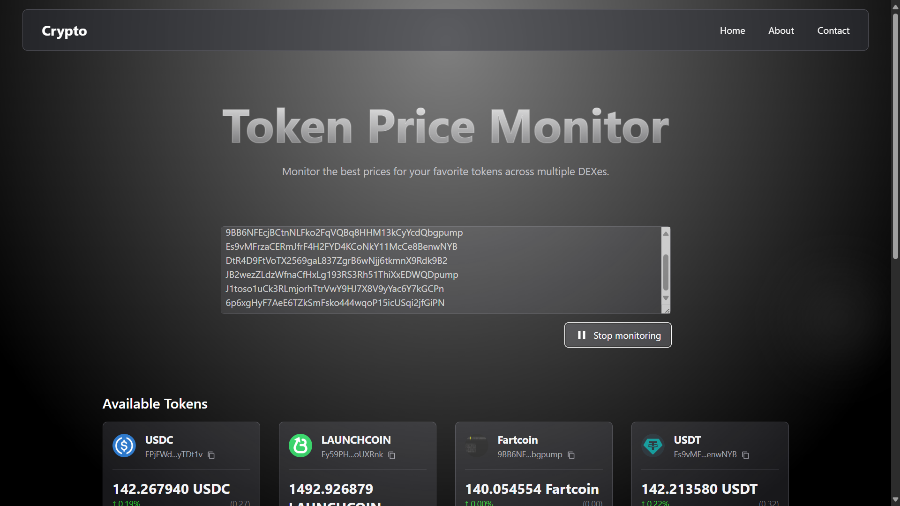
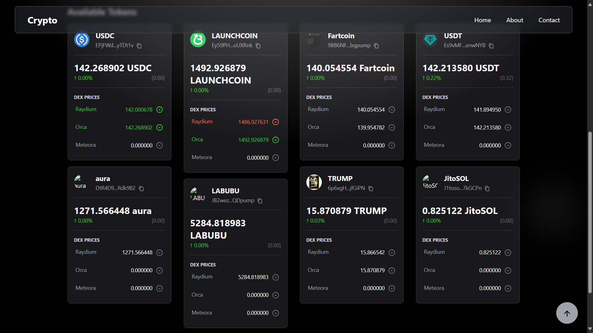
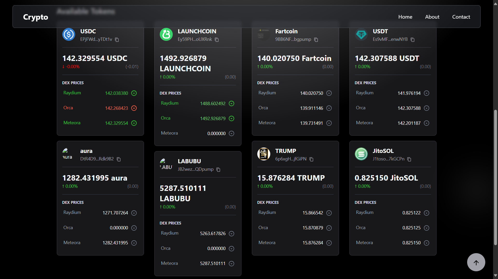
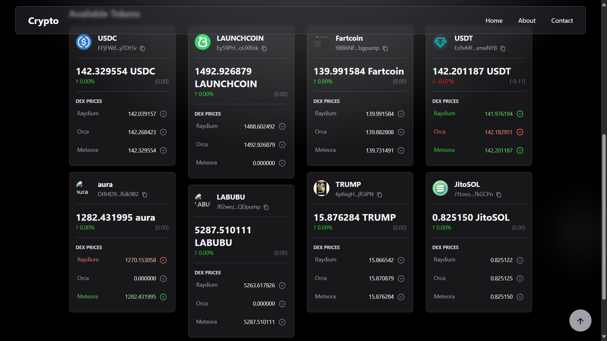
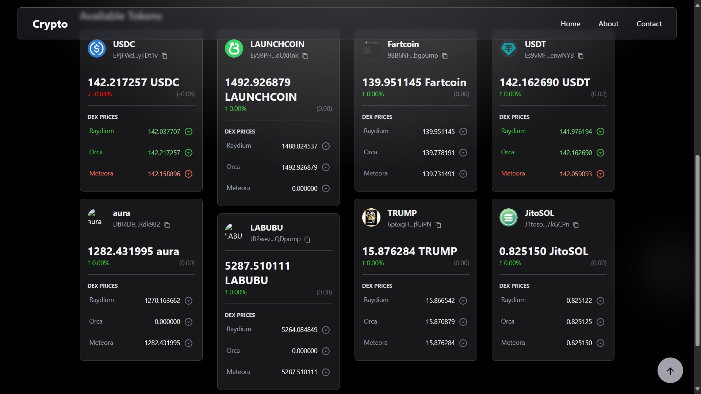
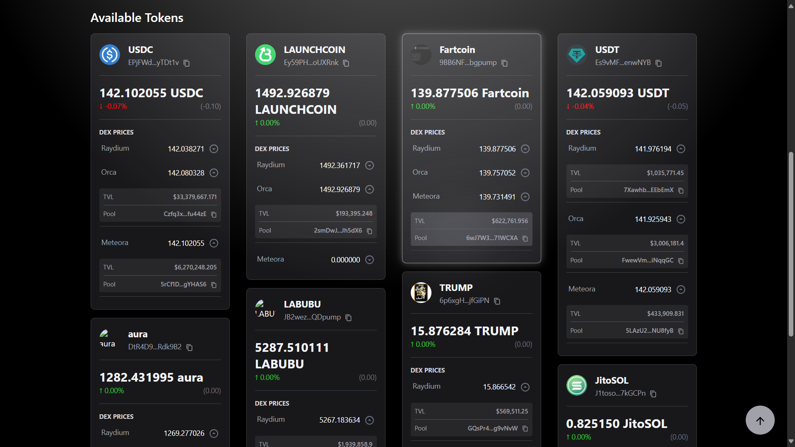
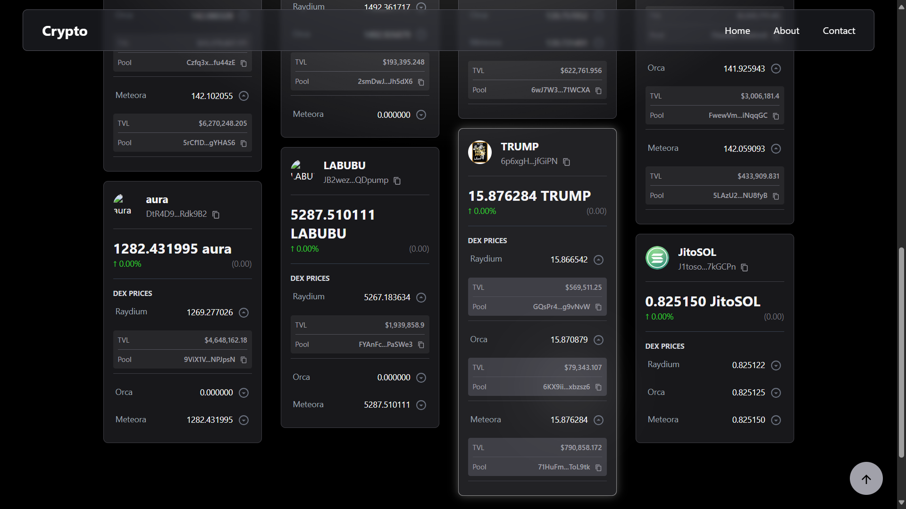

# Week 03 - Solana DeFi Price Monitor

A real-time cryptocurrency price monitoring application that tracks token prices across multiple Solana DEXes (Decentralized Exchanges) including Raydium, Orca, and Meteora. The application provides live price updates, price change visualization, and pool information for various tokens.

## 🏗️ Architecture

### Frontend (React TypeScript)
- **Framework**: React 18 with TypeScript
- **UI Library**: Material-UI (MUI) for modern components
- **Styling**: Tailwind CSS for custom styling
- **Real-time Communication**: Socket.IO client for live data
- **Routing**: React Router for navigation
- **Layout**: Responsive masonry grid layout

### Backend (NestJS TypeScript)
- **Framework**: NestJS with TypeScript
- **Real-time Communication**: WebSocket with Socket.IO
- **Blockchain Integration**: 
  - Raydium SDK for Raydium DEX
  - Orca Whirlpools SDK for Orca DEX
  - Meteora SDK for Meteora DEX
- **Architecture**: Gateway pattern for Solana WebSocket connections

## 📃 Project Flow
1. **Frontend**: Gets token addresses from user input and establishes WebSocket connections to the backend.
2. **Backend**: Listens for WebSocket events, fetches token data from the respective DEXes, and emits real-time updates to the frontend.
3. **Frontend**: Receives updates and displays them in a responsive UI, showing token prices, changes, and pool information.

## 🚀 Features
- **Real-time Price Monitoring**: Live price updates from multiple DEXes
- **Multi-DEX Support**: Tracks prices across Raydium, Orca, and Meteora
- **Price Change Visualization**: Shows price changes with visual indicators
- **Pool Information**: Displays TVL (Total Value Locked) and pool addresses
- **Responsive Design**: Modern, clean interface with dark theme
- **Token Search**: Search and monitor specific tokens by address
- **Live WebSocket Connections**: Separate connections for each DEX platform

## 📚 Real-time Price Monitoring Method
Since there is no Websocket to get the price of tokens from DEXes, we retrieve the pool's information from the DEXes using Solana Mainnet WebSocket and calculate the price of the token using formulas (AMM, CLMM, DLMM, etc.).

## 📁 Project Main Structure

```
week-03/
├── client/                     # React frontend application
│   ├── src/
│   │   ├── components/         # Reusable UI components
│   │   ├── config/             # TypeScript interfaces and constants
│   │   ├── pages/              # Page components
│   │   └── App.tsx             # Main application component
│   ├── package.json            # Frontend dependencies
│   └── tailwind.config.js      # Tailwind CSS configuration
│
└── server/                     # NestJS backend application
    ├── src/
    │   ├── core/               # Core utilities and interfaces
    │   |   ├── constants/      # Core constants (DEX names, token types)
    │   │   ├── interfaces/     # Core interfaces (IDexProvider, IToken)
    │   │   └── utils/          # Core utility functions
    │   ├── modules/            # NestJS modules (dex, tokens)
    │   │   ├── dex/            # DEX module with providers and gateways
    │   │   │   ├── gateways/   # WebSocket gateways for each DEX
    │   │   │   ├── providers/  # DEX-specific providers (Raydium, Orca, Meteora)
    │   │   │   └── services/   # DEX services for business logic
    ├── package.json            # Backend dependencies
    └── nest-cli.json           # NestJS CLI configuration
```

## 🛠️ Prerequisites

Before running this project, make sure you have the following installed:

- **Node.js** (v16 or higher)
- **npm** or **yarn** package manager
- **Git** (for cloning the repository)

## 📦 Installation & Setup

### 1. Clone the Repository
```powershell
git clone <repository-url>
cd learn-blockchain/week-03
```

### 2. Backend Setup
```powershell
# Navigate to the server directory
cd server

# Install dependencies
npm install

# Start the development server
npm run start:dev
```

The backend server will start on `http://localhost:3001`

### 3. Frontend Setup
```powershell
# Open a new terminal and navigate to the client directory
cd client

# Install dependencies
npm install

# Start the development server
npm run start
```

The frontend application will start on `http://localhost:3000`

## 🏃‍♂️ Running the Application

### Development Mode

1. **Start the Backend Server**:
   ```powershell
   cd server
   npm run start:dev
   ```

2. **Start the Frontend Application** (in a new terminal):
   ```powershell
   cd client
   npm start
   ```

3. **Access the Application**:
   - Frontend: `http://localhost:3000`
   - Backend API: `http://localhost:3001`

### Production Mode

1. **Build the Frontend**:
   ```powershell
   cd client
   npm run build
   ```

2. **Build and Start the Backend**:
   ```powershell
   cd server
   npm run build
   npm run start:prod
   ```

## 🔍 Usage

1. **Start Both Servers**: Make sure both frontend and backend are running
2. **Add Token Addresses**: Use the input field to add Solana token mint addresses
3. **Monitor Prices**: Watch real-time price updates across different DEXes
4. **View Pool Information**: Click on cards to see detailed pool information
5. **Price Changes**: Green indicates price increases, red indicates decreases

## ⚠️ Limitations

### Error 429: Too Many Requests
This error occurs when the application exceeds the rate limit for Solana public RPC nodes per IP. To resolve this:
- **Use a Private RPC Node**: Consider using a private Solana RPC provider (Helius, Quicknode, etc.) to avoid rate limits but costs may apply.
- **Reduce Request Frequency**: Implement throttling or debouncing in the frontend to limit the number of requests sent to the backend.
- **Implement polling**: Instead of sending requests for every price change, implement a polling mechanism to fetch updates at regular intervals.

### Other Considerations
- **Network Latency**: Real-time updates may be affected by network conditions.
- **Token Address Validity**: Ensure that the token addresses provided are valid and exist on the Solana blockchain.

## 💻 Web UI
The web UI is designed to be responsive and user-friendly, featuring a modern dark theme with a masonry grid layout. It allows users to easily add and monitor multiple tokens, view real-time price updates, and access detailed pool information.

Here are some screenshots of the application:









## 📄 License

This project is for educational purposes as part of the blockchain learning series.